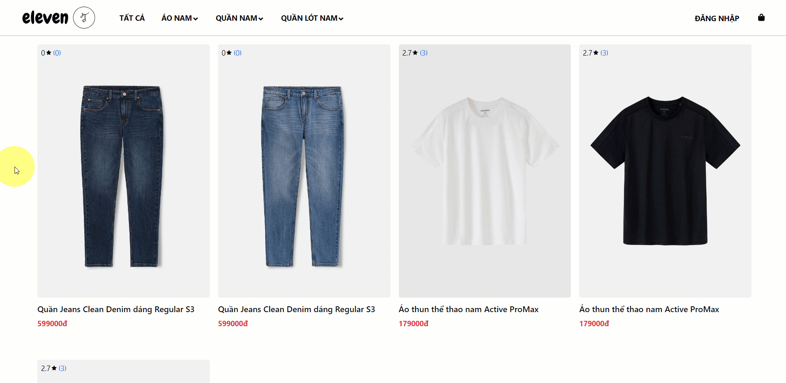
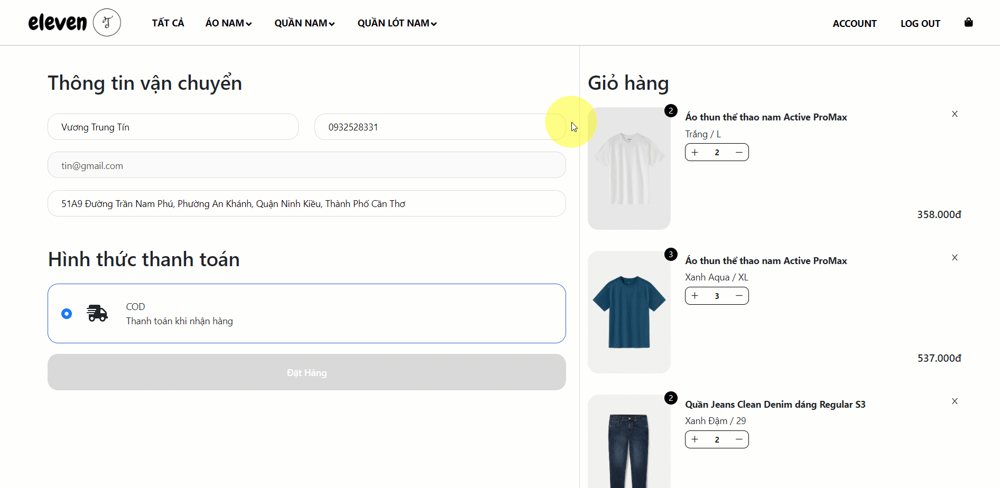
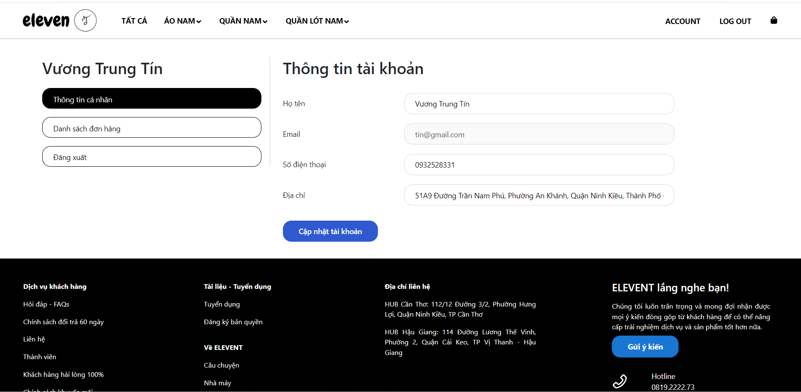
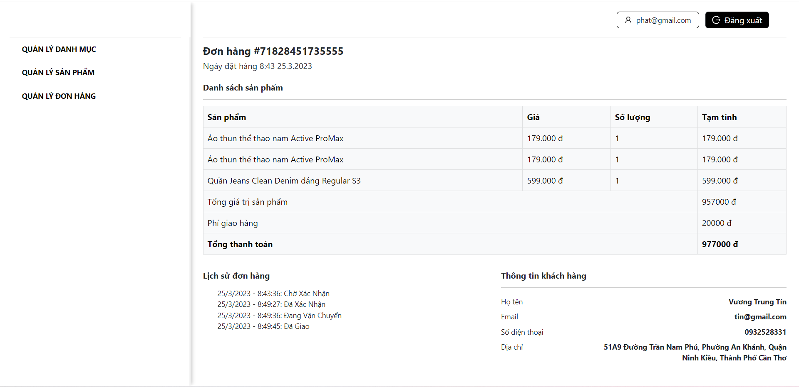
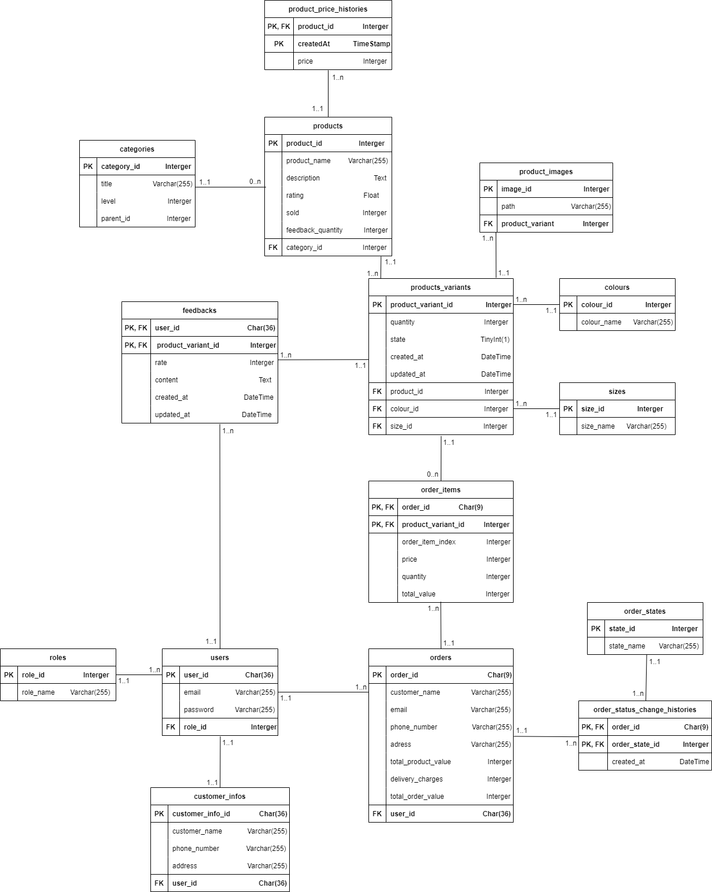

# NHỮNG CHỨC NĂNG CHÍNH
- ### Trang portal
  - Quản lý danh mục sản phẩm
  - Quản lý màu sắc sản phẩm
  - Quản lý size sản phẩm
  - Quản lý sản phẩm
  - Quản lý biến thể sản phẩm 
  - Quản lý đơn hàng
- ### Trang landing
  - Tìm kiếm sản phẩm theo danh mục
  - Xem chi tiết sản phẩm
  - Giỏ hàng
  - Xem lịch sử đơn hàng
  - Xem chi tiết đơn hàng
  - Đánh giá sản phẩm
- ### Chung
  - Authentication với JWT Access Token và tự động gia hạn bằng Cookie Refresh Token khi Access Token hết hạn
  - Validate với React Hook Form
  - Caching với Tanstack Query

# CÔNG NGHỆ SỬ DỤNG
- Frontend: NextJS, Zustand, Ant Design, React Hook Form, Tanstack Query, Bootstrap
- Backend: NodeJS (ExpressJS), Sequelize
- DBMS: MySQL

# GIAO DIỆN TRANG LANDING
## 1. Trang chủ

## 2. Trang danh sách sản phẩm

## 3. Trang chi tiết sản phẩm

## 4. Trang giỏ hàng

## 5. Trang thông tin khách hàng

## 6. Trang lịch sử đơn hàng

## 7. Trang chi tiết đơn hàng

# GIAO DIỆN TRANG PORTAL
## 1. Trang quản lý danh mục

## 2. Trang quản lý sản phẩm

## 3. Trang thêm sản phẩm

## 4. Trang quản lý đơn hàng

## 5. Trang chi tiết đơn hàng

# THIẾT KẾ DỮ LIỆU - SƠ ĐỒ THỰC THỂ QUAN HỆ

